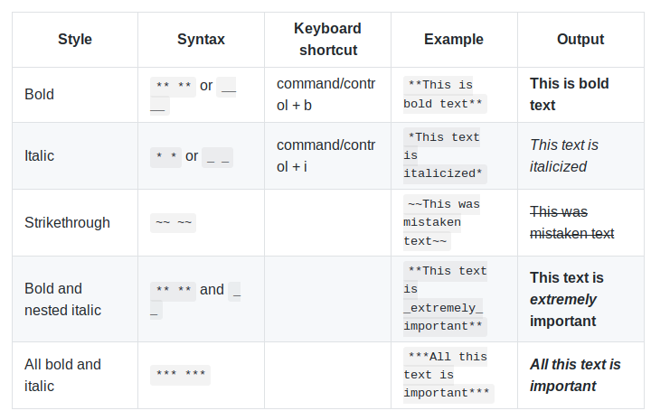

# Basic writing and formatting syntax

Create sophisticated formatting for your prose and code on GitHub with simple syntax.

For more information:
[Part 2](Part2.md)
[Part 3](Part3.md)
[Part 4](Part4.md)

Part 1:

- [Headings](#Headings)
- [Styling text](#Styling-text)
- [Paragraphs and line breaks](#Paragraphs-and-line-breaks)

## Headings

To create a *heading*, add one to six \# symbols before your heading text. 
The number of \# you use will determine the size of the heading.

# The largest heading
## The second largest heading
###### The smallest heading

## Styling text

You can indicate emphasis with bold, italic, or strikethrough text.

## Paragraphs and line breaks

You can create a new *paragraph* by leaving a blank line between lines of text.

###Source: https://help.github.com/en/articles/basic-writing-and-formatting-syntax#ignoring-markdown-formatting

